# WaterWatch
[Please note that the project while working, is not complete at this point, and has not been fully tested or debugged. The Home Assistant code and the Node-RED code has not been posted yet, but it will be soon. The documentation below is incomplete. There will be more to come] 

WaterWatch Home device ready for installation

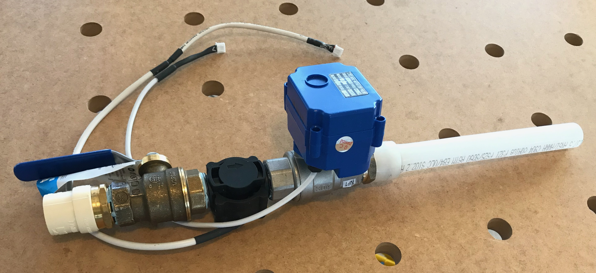

## Introduction
WaterWatch is a hardware/software project to monitor home water usage and to automatically turn off the water supply if a leak is suspected.

There are two versions of the project. One that monitors and protects irrigation (wwi) and another that monitors and protects a whole house (wwh). The wwi project is much simpler, although it does require a third-party smart irrigation device to integrate with. The wwh project has its own motorized valve and attempts to protect water leaks of all kinds including irrigation leaks.

The wwh device installs at your home's water entrance location. The wwi device installs right before your existing irrigation valves. While the wwh device does provide irrigation leak protection, there is utility in having both devices installed in a single home. The wwi device will give you better irrigation water usage values and times than the wwh device, and it will give you additional protection as it can monitor irrigation with greater precision. The wwi device, of course, offers no protection against household leaks.

Features:
* Automatically shuts off water flow based on a wide variety and extensible criteria
* Uses open and popular IOT and smart home standards and technologies
* Integrates with third-party devices and sensors such as water leak sensors and smart irrigation systems
* Integrates into the major smart home user interface devices such as Alexa and Google Assistant
* Accumulates hourly and daily water usage totals. These are sent to the controller on an hourly basis and are also stored in the device and are available on demand
* Accumulates session water usage totals. WaterWatch automatically creates anonymous sessions based on continuous water usage that meets a certain threshold. For instance, if someone showers there will be a water flow start and a stop. If during that start and stop there is sufficient water usage, then WaterWatch will consider that a "session" and will report it to the controller (Home Assistant). The controller can then report that to the user and also calculate costs based on current water rates. Another useful example of an anonymous sessions would be something like filling up a hot tub. How much water did you use and at what cost? Since WaterWatch Home monitors the water flow of the entire house and other water can flow simultaneously, common sense will have to be used to know if the session was truly just one water event.
* Accumulates named session water usage totals. A named session is similar to an anonymous session except the start and stop times are specified by the controller, and it is given a name. The usefulness of this feature can probably best be explained using an example. Your washing machine (an ordinary non-smart appliance) is connected to a smart plug that monitors power usage. When Home Assistant determines that the washing machine has started a wash (based on power usage data sent from the smart plug) it notifies WaterWatch that a washer load has started. WaterWatch then tells the WaterWatch device to start a named session called "Washer." When Home Assistant subsequently notifies WaterWatch that the load is finished, WaterWatch will tell the device to stop the session. The device then notifies the controller of all water that was used during the start and stop times. WaterWatch then notifies the user of the amount and cost of water used during the wash, as well as the electrical power cost. As mentioned above, common sense needs to be used to know if the water usage was from just the washing machine.

The project uses the following technologies:

Hardware both wwi and wwh:
* [ESP32 development board](https://www.amazon.com/s?k=esp32&i=electronics) 
* [Water flow meter](https://www.amazon.com/gp/product/B079HFY2TY/ref=as_li_qf_asin_il_tl?ie=UTF8&tag=modernhousete-20&creative=9325&linkCode=as2&creativeASIN=B079HFY2TY&linkId=4a06247b4565efc779c4903c487a107c)
* Various electronic parts and wire
* Various plumbing connectors

Hardware wwh only:
* [Motorized valve](https://www.amazon.com/gp/product/B071YBPDSL/ref=as_li_qf_asin_il_tl?ie=UTF8&tag=modernhousete-20&creative=9325&linkCode=as2&creativeASIN=B071YBPDSL&linkId=0060bc6192cbfcc1f13b25110fc73cd2) 
* [Water leak sensors](https://www.amazon.com/gp/product/B07D39MSZS/ref=as_li_qf_asin_il_tl?ie=UTF8&tag=modernhousete-20&creative=9325&linkCode=as2&creativeASIN=B07D39MSZS&linkId=1c9f2f9394bb7cacb1f4fc763b7b08c9) (optional) We've used Aqara sensors which also require an Aqara hub. Integration to the WaterWatch system is through Home Assistant and Node-RED. Any detector that integrates into Home Assistant could be used.

Software:
* [Esphome](https://esphome.io) Esphome is a device software development platform. We define our sensors and other devices using esphome yaml syntax and then transition the logic to the C++ code.
* [MQTT](http://mqtt.org) Communication to and from The WaterWatch WiFi device is through the MQTT protocol.
* [Node-RED](https://nodered.org) The logic outside of the device is written in Node-RED. Node-RED is a well-supported, open-source IOT platform. Programming in Node-RED is primarily in Javascript.
* [Home Assistant](https://www.home-assistant.io) Home Assistant is a well-supported, open source, smart home platform that allows us to integrate our device and code with the many other devices and sub-systems that Home Assistant supports. It also provides us a UI and notification platform, and hosts the MQTT server and Node-RED.

Detailed software design instructions will follow.

## Overall design

A one line communication diagram is: device<->MQTT<->Node-RED<->Home Assistant

At its most basic, the project produces an ESP32 device that connects to a water flow sensor and controls a motorized water valve (wwh only). It communicates using WiFi to an MQTT server, which in turn communicates with the smart home system (Home Assistant). 

When water flow or usage exceeds the values provided by the smart home software, the device acts by sending an alarm and (on the wwh device) turning off the valve.

The software in the smart home system is more sophisticated because we can leverage reliable systems in the smart home software, such as occupancy sensors, the on/off status of water using appliances (such as washing machines), irrigation valves that are open, and smart phone and smart device notification features (such as Alexa and Google Assistant). For instance, when the smart home software sets a state of "house is unoccupied" then WaterWatch can tell the WaterWatch device to alarm on *any* water usage (or very little to accommodate running washers and dishwashers). If our washer is powered on, then the smart home software can detect that and we can allow a specific amount of water flow while it is on. 

The smart home software can also integrate WaterWatch with water detection monitors. When a sensor detects water (under a sink for instance), WaterWatch is notified and it will instruct the device to turn off the house water valve.

In the future we would like to implement "signature" water flow events. A very simple signature event would be, for instance, a toilet flush. The water flow increases a certain amount for certain amount of time. When that is detected we know what that water flow was and we can then do something with this information. At this point we can send a water flow "signature" to the device, but the actual detection of the event is only partially implemented. 

### Prerequisites

* Home Assistant running an MQTT server and hosting Node-RED. It would possible to adapt WaterWatch to other smart home platform, such as OpenHAB, that can use MQTT or Node-RED.

* [Esphome setup for a command-line environment](https://esphome.io/guides/getting_started_command_line.html). While the web based ESPHome dashboard usage of Esphome would work, that feature loses it utility for a project that supports multiple configurations, is more complex than just one or more sensors reporting status, and is mostly C++ based.

### WaterWatch Home (wwh) hardware design

WaterWatch Home (wwh) device ready for installation

This particular unit will attach to the existing house plumbing at the water house entrance using PVC from the street and Uponor PEX to transition to the house's copper piping. The small black device in the middle is the water flow sensor and the blue and metal device is the motorized valve. Both of these devices attach to the WaterWatch CPU using the white cables visible in the image. The manual valve in the image is not necessary for the WaterWatch system, but is there to replace an existing manual valve at the installation location.

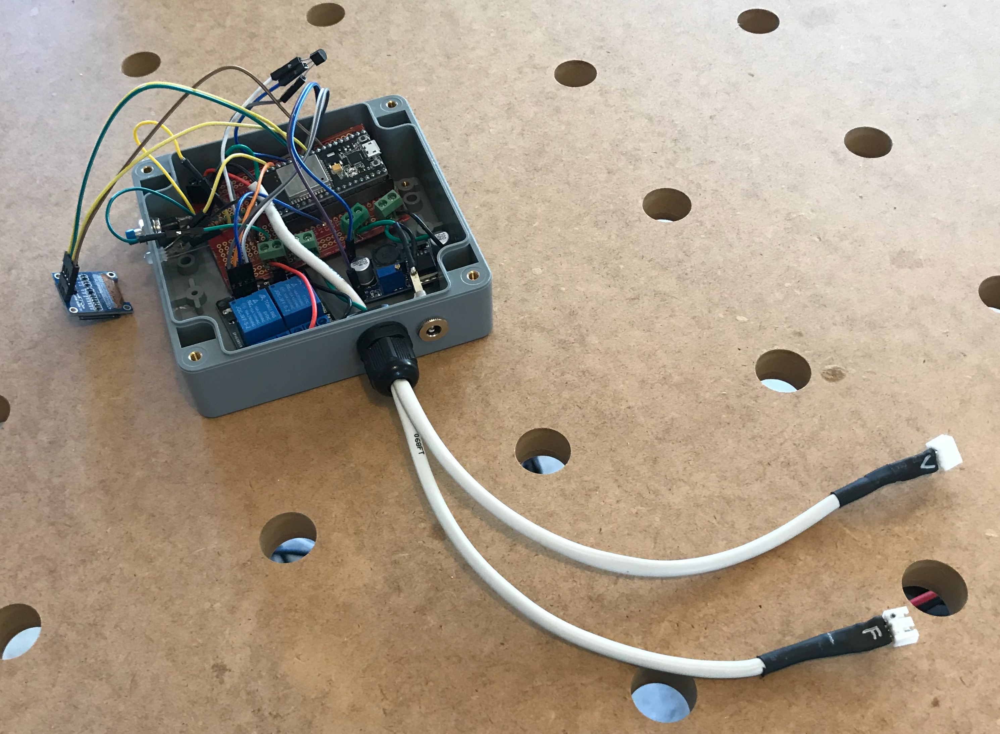

#### Prerequisites

#### Plumbing Components:

#### CPU Components:
* 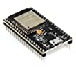[ESP-32S-Development-Board](https://amzn.to/3go0uMI)
* 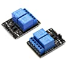[2 Channel Relay](https://amzn.to/2ztyLcZ)
* 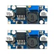[Buck converter LM2596](https://amzn.to/2yAE8Xq)
* 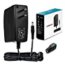[12v-Power-Supply-Single](https://amzn.to/3d2AhkF) These are excellent power supplies that put out a reliable steady 12 volts
* or 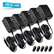[12v-Power-Supply-5-pack](https://amzn.to/2X5wtdf) If you need more than two then this five pack is a good deal
* [OLED LCD Display](https://amzn.to/2ZzWX85)
* 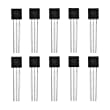[Dallas-Temperature-Sensor DS18B20](https://amzn.to/3egIFNS) 
* [PCB-Mount-Screw-Terminal](https://amzn.to/2TA10xv)
* 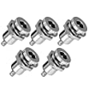[DC-Power-Jack-Socket](https://amzn.to/2zim1pF)
* 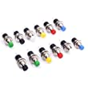[Momentary-switch](https://amzn.to/2TCt973)
* 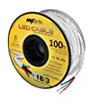[3-Conductor-Cable](https://amzn.to/3gnVBUa)
* 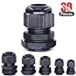[Cable-Gland](https://amzn.to/2Zy9t89)
* [Hook-up-Wire-Kit](https://amzn.to/36udw76)
* 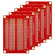[Breadboard](https://amzn.to/2TAdzZE)
* or 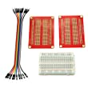[Breadboard-kit](https://amzn.to/3eeRYhd)
* 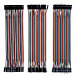[Dupont-cables](https://amzn.to/2XqUVo3)
* 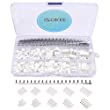[Cable-connectors](https://amzn.to/2yA37Kw) Other suitable three conductor connectors will do -- this is just what I used. These work well, although they are not waterproof. If weather-proofing is needed, I recommend sealing the connection with heat shrink tubing over a water-resistant non-conductive gel (or ordinary caulk which should be non-conductive once dry), then labeling the joint so the next user knows where it is detachable.
* 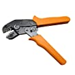[Crimping-tool-for-above](https://amzn.to/3ehfoCQ) 
* 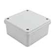[Enclosure](https://amzn.to/2XFp3MT) While this is not the enclosure I used in the image, it is of a similar size (120mm x 120mmm x 60mm, external). I had to trim the breadboard to get it to fit in the enclosure you see in the image, so either this size board or the component layout is not perfect. 

### WaterWatch Irrigation (wwi) hardware design

#### Prerequisites

* A smart irrigation device that integrates into the same smart home platform used for WaterWatch.

Copyright 2020 Brenton Olander

[The Amazon links above are affiliate links, which means that I get a little bit of money from Amazon should you purchase using the link. The price for you will be exactly the same whether you purchase using the link or not. If it is convenient for you to purchase using the link then thank you very much.]

